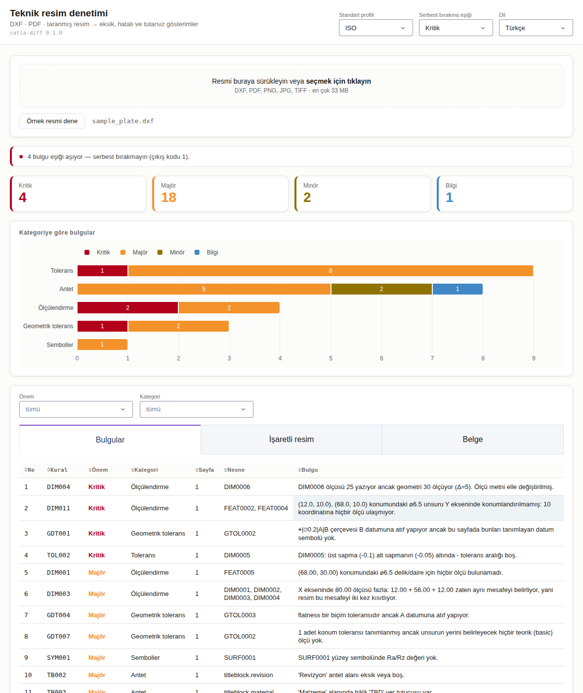

# catia_diff — 2B teknik resim denetim ajanları

2B teknik resimlerdeki **eksik, hatalı veya tutarsız** unsurları bulan çok ajanlı
bir denetim aracı. DXF ve PDF girdilerini vektörel olarak ayrıştırır, taranmış
sayfalar için Claude Vision'a düşer, ISO / ASME Y14.5 kurallarını uygular ve
önceliklendirilmiş, işaretlenmiş bir rapor üretir.

*A multi-agent auditor for 2D engineering drawings: vector-first parsing (DXF /
PDF), Claude Vision fallback for scans, ISO / ASME rule checks, and a
prioritised, marked-up report.*

---

## Neler bulur? / What it finds

| Aile | Örnek bulgular |
| --- | --- |
| Ölçülendirme (`DIM001–DIM015`) | **konumu belirlenmemiş delik**, ölçü zincirine bağlanmamış geometri, ölçüsüz görünüş, ölçülendirilmemiş delik, kapalı ölçü zinciri (aşırı ölçülendirme), **ölçü metni geometriyle uyuşmuyor**, eksik ⌀ sembolü, toplam ölçü yok, açısı verilmemiş eğik kenar |
| Görünüşler arası (`CRV001–CRV003`) | **hizalı görünüşler aynı ölçüyü farklı veriyor**, görünüş geometrileri uyuşmuyor, aynı ölçü iki görünüşte tekrarlanmış |
| Tolerans (`TOL001–TOL012`) | toleranssız ölçü (genel tolerans notu yoksa majör), ters/sıfır tolerans aralığı, ondalık hane uyumsuzluğu, gerçekçi olmayan dar tolerans, karışık gösterim, **ISO 2768 ve ISO 286 sayısal denetimleri** (aşağıya bakın) |
| Geometrik tolerans (`GDT001–GDT011`) | tanımsız datum referansı, datumsuz diklik/konum toleransı, datumlu biçim toleransı, tekrarlanan datum, teorik ölçüsü olmayan konum toleransı, genel geometrik toleranstan geniş çerçeve |
| Semboller (`SYM001–SYM005`) | değersiz yüzey sembolü, ölçüsüz kaynak sembolü, adımsız aralıklı kaynak, gerçekçi olmayan Ra |
| Antet (`TB001–TB011`) | antet yok, zorunlu alan boş, "TBD" yer tutucusu, standart dışı ölçek, tarihsiz revizyon, çizen = onaylayan, izdüşüm yöntemi yok, birim yok, sayfa numarası tutarsız |
| Tutarlılık (`CON001–CON006`) | karışık birimler, ölçek–geometri uyuşmazlığı, sayfalar arası resim no çakışması, görsel çıkarım yapılmadan okunamayan sayfa |

Tam liste: `catia-diff rules --lang tr` (63 kural)

### ISO 286 geçme sınıfları sayısal olarak

`⌀25 H7` artık "bilinmeyen tolerans" değil: IT dereceleri ve temel sapma tabloları
`catia_diff.standards.iso286` içinde veridir, gösterim gerçek sapmalara çözülür ve
**tüm sayısal tolerans kuralları geçmeli ölçülerde de çalışır**.

```python
deviations(25.0, parse_fit("H7"))       # (0.021, 0.0)
clearance(25.0, parse_fit("H7/p6"))     # (-0.035, -0.001) → sıkı geçme
deviations(25.0, parse_fit("u6"))       # None — kapsam dışı, tahmin yok
```

İki yeni kural: `TOL011` geçme sınıfı sayıya çevrilemedi (nedeniyle birlikte) ·
`TOL012` sıkı/geçiş geçme, hesaplanmış boşluk aralığıyla. Delik sapmaları
tablodan değil standardın kendi kurallarından türetilir (`EI = −es`, Δ kuralı) ve
tablolar ISO'nun üretici formülüne karşı testlerde doğrulanır.

Kapsam, sınırlar ve tam tablolar: [`docs/ISO286.md`](docs/ISO286.md).

### Eksik ölçülendirme sayısal olarak

Uygulama "her deliğin çapı var mı" diye bakmakla yetinmez; **konumun türetilebilir
olup olmadığını** denetler. Her görünüşte, her eksende geometrinin referans
koordinatları düğüm, ölçüler kenardır; tam ölçülendirilmiş bir görünüş bu grafikte
bir **kapsayan ağaçtır**:

| Grafik | Anlamı |
| --- | --- |
| Bağlantılı, çevrimsiz | Tam ölçülendirilmiş |
| `bileşen − 1` kopukluk | O kadar **eksik ölçü** (`DIM011`, `DIM012`) |
| `çevrim` sayısı | O kadar **fazla ölçü** (`DIM003`, `TOL010`) |

Örnek resimdeki gerçek kusur — dört delikten ikisi düşey eksende hiç
konumlandırılmamış:

```
KRITIK DIM011  (12.0, 10.0), (68.0, 10.0) konumundaki ⌀6.5 unsuru Y ekseninde
               konumlandırılmamış: 10 koordinatına hiçbir ölçü ulaşmıyor.
```

GD&T konum toleransı, `4x ⌀6.5 EŞİT BÖLÜNMÜŞ` patern notu, blanket notlar
(`TÜM RADYÜSLER R3`) ve referans ölçüler ayrıca ele alınır — ayrıntılar ve sınırlar:
[`docs/DIMENSION_COVERAGE.md`](docs/DIMENSION_COVERAGE.md).

### Görünüşler arası tutarlılık

Bir görünüşün içinde doğru olan her şey, diğer görünüşle çelişebilir. Ortografik
yerleşimde üst görünüş ön görünüşün **genişliğini**, yan görünüş **yüksekliğini**
paylaşır; düz bir kâğıtta iki görünüşü birbirine bağlayan tek şey bu ortak
uzunluktur — ve iki soruyu cevaplamaya yeter:

```
catia-diff audit examples/sample_views.dxf --lang tr
  KRITIK  CRV001  Görünüş 1 ortak X ölçüsünü 80 veriyor, Görünüş 3 ise 76 diyor.
  MAJÖR   CRV002  Görünüş 1 Y ekseninde 40 çizilmiş, hizalı Görünüş 2 ise 38 (Δ=2).
```

Aynı mekanizma bir **yanlış pozitifi de kapatır**: ortografik uygulama bir ölçüyü
tek görünüşte verir, o yüzden üst görünüşün X'i ölçülendirmemesi doğrudur. Kapsam
kuralları artık hizalı görünüşten **miras** alır; bu olmadan doğru çizilmiş her
çok görünüşlü resim uydurma "eksik ölçü" bulgusu üretirdi.

Sınır dürüstçe konmuştur: iki görünüş ortak uzunlukları %10'dan fazla ayrışıyorsa
aynı şeyi gösterdikleri kanıtlanamaz (detay, kopuk görünüş, farklı ölçek) ve
hiçbir kural çalışmaz — tahmin etmek yerine susar.

### ISO 2768 sayısal olarak

`ISO 2768-mK` gibi bir genel tolerans notu, tablolarıyla birlikte
`catia_diff.standards.iso2768` içinde veridir; not okunduğu anda her ölçü için
izin verilen sapma sayıya dönüşür:

| Kural | Ne denetler | Örnek bulgu |
| --- | --- | --- |
| `TOL006` | Notun sınıf harfi var mı, geçerli mi | "ISO 2768" — sınıf belirtilmemiş, sayı türetilemiyor |
| `TOL007` | Nominal ölçü tablonun kapsamında mı | 0,3 mm ölçü: tablo 0,5 mm'den başlıyor → sapma ölçünün üzerinde yazılmalı |
| `TOL008` | Yazılı tolerans genel toleranstan geniş mi | 40 mm'de ±1,5; `ISO 2768-m` ±0,3 veriyor |
| `TOL009` | Yazılı tolerans genel toleransın aynısı mı | 56 mm'de ±0,3 — gereksiz tekrar |
| `TOL010` | Kapalı zincirde tolerans birikimi toplam ölçüye sığıyor mu | 12+56+12 zinciri ±0,7 biriktiriyor, toplam ölçü ±0,3 veriyor |
| `GDT011` | Çerçeve, ISO 2768-2 genel geometrik toleransından geniş mi | Düzlemsellik 0,8; sınıf K 80 mm için 0,2 veriyor |

Tablolar ISO 2768-1 (boyut/açı, sınıf f·m·c·v) ve ISO 2768-2 (düzlemsellik–
doğrusallık, diklik, simetri, dairesel salgı; sınıf H·K·L) ile türetilmiş
kuralları (yuvarlaklık ≤ salgı, paralellik = maks(boyut toleransı, düzlemsellik))
içerir. Standardın tanımlamadığı yerler (silindiriklik, konum, açısallık, profil)
`None` döner ve kural sessiz kalır — tahmin üretilmez. `in` biriminde çizilmiş
resimlerde değerler mm'ye çevrilip geri dönüştürülür.

Tabloların tamamı, kural eşlemesi, varsayımlar ve Python API'si:
[`docs/ISO2768.md`](docs/ISO2768.md).

## Kurulum / Install

```bash
python -m venv .venv && source .venv/bin/activate
pip install -e ".[all,dev]"       # veya: pip install -e ".[dxf,pdf,raster,report]"
```

Çekirdek yalnızca `pydantic` ister. İsteğe bağlı ekler:
`dxf` (ezdxf) · `pdf` (PyMuPDF) · `raster` (Pillow, NumPy) · `cv` (OpenCV) ·
`llm` (anthropic) · `report` (Jinja2) · `ui` (Dash, tarayıcı arayüzü). Eksik
olan bir ek yalnızca ilgili yolu kapatır, programı durdurmaz.

Claude Vision için kimlik: `export ANTHROPIC_API_KEY=...` (veya `ant auth login`).

## Kullanım / Usage

```bash
# Örnek resim depoda hazır (kasıtlı hatalarla) - doğrudan denetleyin
catia-diff audit examples/sample_plate.dxf --lang tr --out reports

# Üreteci yeniden çalıştırmak isterseniz:
python examples/generate_sample_drawing.py examples/sample_plate.dxf

# ISO 2768-mK notlu varyant: sayısal genel tolerans denetimlerini tetikler
python examples/generate_sample_drawing.py examples/sample_2768.dxf --iso2768
catia-diff audit examples/sample_2768.dxf --lang tr --out reports

# Tam ölçülendirilmiş varyant: kapsam kuralları hiç bulgu üretmemeli
python examples/generate_sample_drawing.py examples/sample_ok.dxf --complete
catia-diff audit examples/sample_ok.dxf --lang tr --out reports

# Üç ortografik görünüş: görünüşler arası çelişki (ve doğru varyantı)
python examples/generate_sample_drawing.py examples/sample_views.dxf --views
python examples/generate_sample_drawing.py examples/sample_views_ok.dxf --views --complete
catia-diff audit examples/sample_views.dxf --lang tr

# ISO 286 geçme sınıfları: sıkı geçme ve kapsam dışı harf
python examples/generate_sample_drawing.py examples/sample_fits.dxf --fits
catia-diff audit examples/sample_fits.dxf --lang tr --out reports

# Taranmış PDF: metin katmanı yoksa otomatik olarak Claude Vision devreye girer
catia-diff audit tarama.pdf --vision auto --dpi 300

# ASME profili, yalnızca kritik bulgular, CI için sert çıkış kodu
catia-diff audit part.dxf --profile ASME --min-severity critical --fail-on critical

# Kural seçimi
catia-diff audit part.dxf --only DIM001,DIM003
catia-diff audit part.dxf --disable TOL001 --category gdt,title_block

# Tarayıcı arayüzü
catia-diff ui --port 8050 --lang tr
```

Çıkış kodları: `0` temiz · `1` `--fail-on` eşiğinde bulgu var · `2` dosya
okunamadı.

Üretilen dosyalar: `<ad>_audit.json`, `<ad>_audit.md`, `<ad>_audit.html`
(filtrelenebilir kartlar, açık/koyu tema) ve sayfa başına
`<ad>_sheetN_overlay.png` (bulgular numaralandırılmış kutularla işaretli).

## Web arayüzü / Dashboard

Komut satırı istemeyenler için aynı denetim tarayıcıda:

```bash
catia-diff ui                       # http://127.0.0.1:8050
catia-diff ui --port 8080 --lang en --profile ASME
```

IDE kullanıyorsanız parametre yazmanıza gerek yok: kökteki **`run_ui.py`** dosyasına
sağ tık → *Run* yeter (PyCharm, VS Code). Paket kurulu olmasa bile çalışır; port ve
dil dosyanın başındaki dört sabitten değiştirilir.



Resmi sürükleyip bırakın (ya da **Örnek resmi dene** ile başlayın); sayfa şunu
verir:

* **Serbest bırakma kararı** — seçtiğiniz eşiğe göre, CLI'ın çıkış koduyla aynı
  mantık: *"4 bulgu eşiği aşıyor — serbest bırakmayın (çıkış kodu 1)"*.
* **Önem kartları** ve kategori başına yığılmış çubuk — hangi aile yanıyor.
* **Bulgu tablosu** — önem/kategori filtreli; bir satıra tıklayınca altında
  bulgunun tamamı: mesaj, önerilen düzeltme, standart maddesi, güven ve
  **resimdeki kutu numarası**.
* **İşaretli resim** sekmesi — numaralı kutular tablodaki `No` ile birebir aynı.
* **Belge** sekmesi — çıkarılan nesne sayıları, süre, uyarılar.
* **Raporu indir** — JSON · Markdown · HTML, komut satırındakiyle aynı dosyalar.

Dil anahtarı denetimi yeniden çalıştırmaz: bulgular modelde zaten iki dillidir,
sayfa yalnızca dili değiştirir. Sunucu yereldir; vektörel dosyalarda hiçbir veri
makineden çıkmaz.

### Python API

```python
from catia_diff import AuditConfig, Profile, Severity, audit_file

report = audit_file("part.dxf", AuditConfig(profile=Profile.ISO, language="tr"))
print(report.summary_line("tr"))                    # Kritik: 3 | Majör: 12 …
for finding in report.by_severity(Severity.CRITICAL):
    print(finding.rule_id, finding.localized_message("tr"), finding.evidence.bbox)
```

## Girdi biçimleri / Input formats

| Biçim | Yol | Ne elde edilir |
| --- | --- | --- |
| **DXF** | `ezdxf` | En yüksek doğruluk: ölçüler gerçek ölçülen değerle birlikte gelir, tolerans üstünü yazma (text override) tespit edilebilir, antet blok öznitelikleriyle okunur |
| **PDF (vektörel)** | `PyMuPDF` | Metin aralıkları + vektör geometrisi; çoğu CAD çıktısı bu gruba girer |
| **PDF (taranmış) / PNG, JPG, TIFF** | raster → Claude Vision | Sayfa temizlenir, döşenir, yapılandırılmış çıktı ile yazıya dökülür |
| **DWG** | — | Kapalı biçim: önce DXF'e çevirin (`ODAFileConverter <in> <out> ACAD2018 DXF 0 1`) |

> **Neden vektör öncelikli?** "Ölçü 25 yazıyor ama geometri 30" gibi en pahalı
> hatalar yalnızca ölçünün gerçek değerinin bilindiği vektörel girdide
> yakalanabilir. Raster yol tam bir yedektir, eşdeğeri değildir — bu yüzden
> görsel çıkarım yapılmayan taranmış sayfa `CON005` ile ayrıca raporlanır.

## Mimari / Architecture

```
Orchestrator
 ├── Extraction Agent      DXF/PDF/raster → DrawingDocument (+ Claude Vision)
 ├── Dimensioning Agent    DIM · TOL · GDT · SYM kuralları   ┐ paralel
 ├── Title Block Agent     TB kuralları                      │ çalışır
 ├── Consistency Agent     CON kuralları                     ┘
 └── Report Agent          tekilleştir → önceliklendir → overlay + JSON/MD/HTML
```

Ayrıntılar, akış diyagramı, mesaj protokolü ve veri modeli:
[`docs/ARCHITECTURE.md`](docs/ARCHITECTURE.md) · ISO 2768 sayısal referansı:
[`docs/ISO2768.md`](docs/ISO2768.md) · ISO 286 geçme referansı:
[`docs/ISO286.md`](docs/ISO286.md) · eksik ölçülendirme modeli:
[`docs/DIMENSION_COVERAGE.md`](docs/DIMENSION_COVERAGE.md).

## Yeni kural ekleme / Adding a rule

```python
# src/catia_diff/rules/dimensioning.py
@register
class MyRule(Rule):
    meta = RuleMeta(
        id="DIM016",
        title="Chamfer without an angle",
        title_tr="Açısı belirtilmemiş pah",
        severity=Severity.MAJOR,
        category=Category.DIMENSIONING,
        standards=("ISO 129-1 §9",),
    )

    def check(self, target: Sheet, ctx: RuleContext):
        for dim in target.dimensions:
            if dim.kind is DimensionKind.CHAMFER and "°" not in dim.text:
                yield self.finding(
                    message=f"Chamfer {dim.id} has no angle.",
                    message_tr=f"{dim.id} pahında açı belirtilmemiş.",
                    sheet_index=target.index,
                    bbox=dim.bbox,
                    object_ids=[dim.id],
                )
```

Kayıt otomatiktir; CLI, rapor ve testler kuralı hemen görür.

## Geliştirme / Development

```bash
pytest -q                      # 374 test, isteğe bağlı bağımlılık yoksa atlanır
pytest --cov=catia_diff        # ~%91 kapsam
ruff check src tests examples run_ui.py
```

Testler ağ erişimi ve tarayıcı gerektirmez: Claude çağrıları `MockVisionModel`
ve sahte bir istemci ile, pano ise Dash'e bağımlı olmayan sunum/servis
katmanıyla doğrulanır.

## Sınırlar / Known limits

* Görünüşler arası denetim **hizalamaya** dayanır: ortografik olarak hizalı
  görünüşlerin paylaştığı toplam uzunluk karşılaştırılır. Unsur düzeyinde eşleme
  (hangi delik hangi görünüşte hangisine karşılık gelir) yapılmaz; hizasız
  yerleştirilmiş veya %10'dan fazla ayrışan görünüş çiftleri karşılaştırılmaz.
* Eksik ölçülendirme analizi **vektör-önce**dir: her ölçünün ölçtüğü aralığı
  bilmeyi gerektirir. DXF bunu verir; PDF metin katmanında ve görsel çıkarımda
  kurallar sessizce çalışmaz (yanlış sonuç üretmek yerine) ve `CON005` durumu bildirir.
* Unsur–ölçü eşleştirmesi ve kapalı zincir (raster yolda) sezgiseldir;
  bulgular `confidence < 1.0` ile işaretlenir.
* DWG doğrudan okunmaz.
* Pano yerel ve tek kullanıcılıktır: kimlik doğrulama, oturum ve kalıcı depolama
  yoktur, yüklenen dosya geçici klasöre yazılır (son 5 koşu tutulur). Ağa açmak
  için önüne kimlik denetimi yapan bir vekil sunucu koyun.
* ISO 286 kapsamı kısmidir: miller `d e f g h js k m n p`, dereceler IT5–IT14,
  ölçüler 0,5–500 mm. Dışında kalan her gösterim çözülmez ve `TOL011` ile
  raporlanır — sessizce tahmin üretilmez.
* ISO 2768-1 açı tablosu açının kısa kenarına göre indekslidir; 2B gösterim bunu
  vermediği için en geniş satır (en güvenli varsayım) kullanılır. Aynı şekilde
  ISO 2768-2 denetimi, çerçevenin ait olduğu unsurun boyu yerine sayfadaki en
  büyük ölçüyü alır — yanlış pozitif yerine eksik rapor tarafında kalır.
