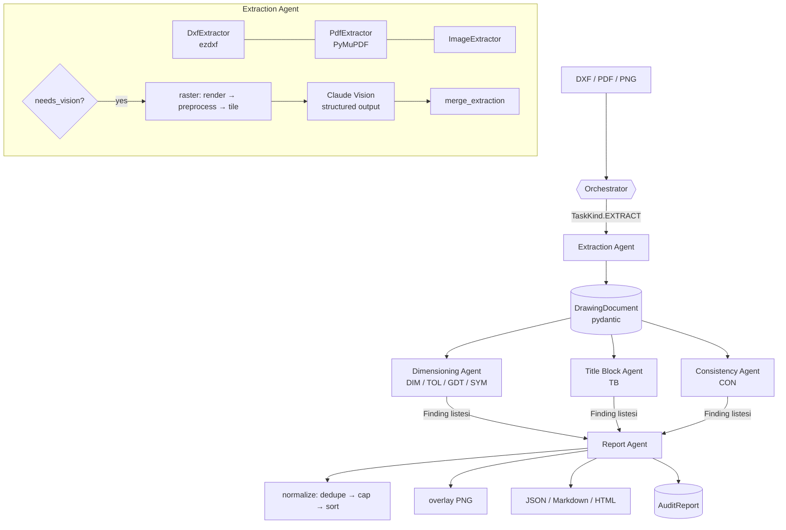

# Mimari / Architecture

> Bu belge Türkçe ve İngilizce paralel ilerler. / This document runs in Turkish and English.

## 1. Genel akış / Pipeline



Aşamalar / Stages:

1. **Extraction** — dosya biçimine göre bir `SourceExtractor` seçilir. Vektörel
   girdide (DXF, metin katmanlı PDF) her şey ayrıştırılır; taranmış sayfalarda
   `needs_vision` işaretlenir ve çok modlu geçiş devreye girer.
2. **Checkers** — üç ajan aynı `DrawingDocument` üzerinde paralel çalışır
   (yalnızca okuma yaparlar, bu yüzden kilit gerekmez).
3. **Reporting** — bulgular tekilleştirilir, önceliklendirilir, sayfa görselleri
   üretilir ve üç formatta rapor yazılır.

## 2. Ajanlar arası protokol / Inter-agent protocol

Ajanlar birbirini doğrudan çağırmaz. Orchestrator her ajana bir `AgentTask`
verir, karşılığında bir `AgentResult` alır:

```python
AgentTask(kind=TaskKind.CHECK_DIMENSIONS, task_id="9f2c…", payload={...})
        ↓
AgentResult(task_id="9f2c…", agent="dimensioning", status=AgentStatus.OK,
            findings=[Finding, …], artifacts={"rules": 30}, warnings=[], duration_ms=12.4)
```

| Alan | Anlamı |
| --- | --- |
| `status` | `ok` / `partial` (örn. vision yok) / `failed` / `skipped` |
| `findings` | Kurallardan çıkan bulgular |
| `artifacts` | Sonraki aşamaya geçen nesneler (`document`, `report`, dosya yolları) |
| `warnings` | Rapor başlığına taşınan uyarılar |
| `duration_ms` | `Agent.execute` tarafından ölçülür |

`Agent.execute()` şablon metottur: süre ölçümü, günlükleme ve **hata
kapsaması** oradadır. Bir ajan çökerse `status=failed` döner, diğer ajanlar
çalışmaya devam eder ve hata raporun uyarılarına düşer — sessizce temiz bir
rapor asla üretilmez.

`AuditContext` ajanların ortak karatahtasıdır: `config`, `source_path`,
`workdir`, çıkarılan `document` ve `vision_model`.

## 3. Veri modeli / Data model

`catia_diff.models` (pydantic v2) çıkarım ile denetim arasındaki sözleşmedir:

```
DrawingDocument
├── source_path, source_format (dxf | pdf_vector | pdf_raster | image)
├── units, metadata, warnings, vision_used
└── sheets: list[Sheet]
    ├── width/height/origin, coordinate_space (y_up | y_down), scale, projection
    ├── needs_vision, raster_path, text_char_count
    ├── title_block: TitleBlock{fields: {canonical_name: TitleBlockField}}
    ├── dimensions:  list[Dimension]  → kind, nominal, measured, tolerance, prefix,
    │                                   is_basic/is_reference/is_text_override, bbox
    ├── geometric_tolerances: list[GeometricTolerance] → characteristic, value,
    │                                   diametral_zone, material_condition, datums
    ├── datums, surface_finishes, welds, annotations, views
    └── features: list[GeometryFeature] → circle/arc/line/polyline (+ points)
```

Koordinatlar **sayfa uzayında** tutulur. DXF y-yukarı ve model uzayında
herhangi bir yerdedir; PDF/raster y-aşağıdır. Bu yüzden her `Sheet` kendi
`coordinate_space` ve `origin` değerini taşır; dönüşüm yalnızca bir kez,
çizim (overlay) sırasında yapılır.

Bulgu tarafı:

```
Finding(rule_id, severity, category, title/title_tr, message/message_tr,
        suggestion/suggestion_tr, standards, evidence=Evidence(sheet_index, bbox,
        object_ids, snippet), confidence, agent, id)
AuditReport(document, profile, findings, document_stats, agent_traces,
            overlays, warnings, duration_ms, extraction_failed)
```

Her bulgu iki dillidir (TR + EN); rapor dili çalışma zamanında seçilir.
`confidence` sezgisel kuralları dürüstçe işaretler (örn. ölçü–unsur eşleştirmesi
0.7, kapalı zincir sezgiseli 0.6).

## 4. Kural motoru / Rule engine

Bir kural = bir sınıf:

```python
@register
class UndimensionedFeatureRule(Rule):
    meta = RuleMeta(id="DIM001", title=…, title_tr=…, severity=Severity.MAJOR,
                    category=Category.DIMENSIONING,
                    standards=("ISO 129-1 §4.1", "ASME Y14.5-2018 §1.4"))
    scope = "sheet"          # veya "document"

    def check(self, target, ctx) -> Iterable[Finding]: ...
```

* `register` kayıt defterine ekler; `rules_for(config)` profil (ISO/ASME),
  kategori ve `--only/--disable` süzgeçlerini uygular.
* `RuleContext` paylaşılan türetilmiş bilgileri önbelleğe alır (genel tolerans
  notu var mı, profil ASME mi).
* `run_rules` her kuralı yalıtır: patlayan bir kural `INFO` bulgusuna dönüşür,
  denetimi durdurmaz.
* Yeni bir denetim eklemek = tek bir sınıf eklemek. Başka hiçbir dosya değişmez.

Sezgisel geometri yardımcıları `rules/analysis.py` içindedir: unsur–ölçü
eşleştirmesi, kapalı zincir tespiti (vektörel girdide ölçü aralıklarıyla
**kesin**, diğerlerinde küme sezgiseliyle), çakışan gösterim tespiti.

## 5. Standart tabloları / Standards tables

`catia_diff.standards.iso2768` ISO 2768'i **veri** olarak tutar: aralık
anlamları ("30 üstü, 120 dâhil") bozulmadan tablolar, sınıf harfleri
(`f m c v` / `H K L`) ve standardın tanımlamadığı yerler için `None`.

```
"GENEL TOLERANSLAR ISO 2768-mK"
        │ parse_designation
        ▼
GeneralToleranceSpec(standard="ISO 2768", linear=m, geometric=K)
        │ deviation_for(dim)              │ geometric_limit_mm(char, size)
        ▼                                 ▼
   ±0.3 mm (56 mm, tablo 1)          0.2 mm (düzlemsellik, 80 mm, sınıf K)
```

`iso286.py` aynı yaklaşımı ISO 286 için uygular: IT dereceleri ve mil temel
sapmaları tablodur, **delik sapmaları standardın kendi kurallarıyla türetilir**
(`EI = −es`; K/M/N/P için `ES = −ei + Δ`), kapsam dışı her kombinasyon `None`
döner. `⌀25 H7` böylece `+0,021/0`'a çözülür ve tüm sayısal tolerans kuralları
geçmeli ölçülerde de çalışır.

Kural tarafı bunları `RuleContext.general_spec(sheet)` üzerinden alır; `TOL006`
notun okunabilirliğini, `TOL007` kapsamı, `TOL008`/`TOL009` yazılı toleransla
karşılaştırmayı, `TOL010` zincir birikimini ve `GDT011` geometrik karşılaştırmayı
denetler. Türetilmiş kurallar (yuvarlaklık ≤ dairesel salgı, paralellik =
maks(boyut toleransı, düzlemsellik)) standardın metnindeki tanımları izler.

Birimler: tablolar mm'dir; inç çizimlerde değer mm'ye çevrilir, sonuç geri
dönüştürülür. Bilinmeyen boyut bilgisi (açının kısa kenarı, çerçevenin ait
olduğu unsurun boyu) için **en geniş** genel tolerans seçilir; böylece
"yazılı tolerans genel toleranstan geniş mi" sorusu yanlış pozitif üretmez.

Tabloların tamamı ve varsayımların gerekçesi: [`ISO2768.md`](ISO2768.md).

## 6. Ölçülendirme kapsamı / Dimensional coverage

`rules/views.py` sayfayı görünüşlere ayırır (mekânsal kümeleme, çıkarım aşamasında
bir kez), `rules/constraints.py` her görünüş için eksen başına bir **kısıt grafiği**
kurar: düğümler geometrinin ulaşılması gereken koordinatları, kenarlar ölçüler.

```
kapsayan ağaç        → tam ölçülendirilmiş
bileşen − 1 kopukluk → o kadar eksik ölçü   (DIM011/DIM012)
çevrim               → o kadar fazla ölçü   (DIM003/TOL010)
```

Analiz ölçülerin ölçtüğü aralığı gerektirir; DXF bunu verir, raster/vision yolu
vermez ve kurallar o zaman hiç çalışmaz. Ayrıntı: [`DIMENSION_COVERAGE.md`](DIMENSION_COVERAGE.md).

## 7. Çok modlu çıkarım / Multimodal extraction

`llm/` katmanı arka uçtan bağımsızdır:

* `VisionModel` (ABC) → `AnthropicVisionModel` (Claude), `MockVisionModel`
  (testler), `NullVisionModel` (`--vision off`).
* İstek biçimi: base64 görsel blokları + talimat, `thinking={"type":"adaptive"}`,
  `output_config={"format": {"type": "json_schema", …}, "effort": …}` ve
  sunucu taraflı red yedeklemesi (`server-side-fallback-2026-07-01`).
* Şema `llm/schemas.py` içindeki `VisionSheetExtraction`'dır; kutular görsele
  göre `0..1` normalize edilir, `llm/merge.py` bunları sayfa uzayına taşır ve
  metni **vektörel yolla aynı** dilbilgisinden geçirir.
* Büyük sayfalar `extract/raster.py` ile döşenir (tile); OpenCV varsa gürültü
  temizleme + eğrilik düzeltme uygulanır, yoksa adım atlanır.

## 8. Arayüz katmanı / Dashboard

`ui/` paketi denetime hiçbir şey öğretmez; yalnızca gösterir. Katmanlar:

| Modül | Sorumluluk | Dash'e bağımlı mı |
| --- | --- | --- |
| `ui/service.py` | Yüklenen dosyayı çözme, boyut/format denetimi, `Orchestrator`'ı çağırma, raporu indirilebilir metne çevirme | hayır |
| `ui/presenters.py` | `AuditReport` → ekran modeli (kartlar, satırlar, grafik verisi, kapı durumu), iki dilli etiketler | hayır |
| `ui/charts.py` | Ekran modeli → Plotly figürü | yalnızca plotly |
| `ui/theme.py` | Renk/ölçü belirteçleri | hayır |
| `ui/app.py` | Yerleşim + geri çağırma bağlantıları | evet |

Kural: **geri çağırmalar (callback) ince kalır.** Her biri `*_view` fonksiyonuna
devreder; bu fonksiyonlar düz değerler alır, düz değerler döndürür ve testten
doğrudan çağrılır (`tests/test_ui.py`). Bir geri çağırmanın döndürdüğü değer
sayısının çıktı sayısıyla eşleştiği bile testle doğrulanır — aksi halde hata
yalnızca tarayıcıda görülür.

Diğer sözleşmeler:

* Yüklenen dosya geçici bir çalışma klasörüne yazılır (`/tmp/catia-diff-ui/…`,
  son 5 koşu tutulur); rapor dosyaları diske yazılmaz, indirmeler bellekteki
  rapordan üretilir.
* Desteklenmeyen uzantı, bozuk base64 veya boyut aşımı **bulgu değil hatadır**:
  ekran nedenini yazar, tahmin üretmez. Uzantı denetimi gerçek çıkarıcı
  kayıt defterinden geçer, böylece DWG için CLI ile aynı yönlendirme çıkar.
* Tablodaki `No` sütunu ile işaretli resimdeki kutu numarası tek kaynaktan
  gelir (`reporting/normalize.overlay_numbers`), bu yüzden ayrışamazlar.
* Önem renkleri tek yerde tanımlıdır (`models/findings.SEVERITY_COLORS`) ve
  overlay, HTML rapor ve pano aynı paleti kullanır; komşu renkler algısal
  ayrım eşiğinin üstünde tutulur, ayrıca önem her yerde metinle de yazılır.

## 9. Tasarım kararları / Design decisions

| Karar | Gerekçe |
| --- | --- |
| Vektör öncelikli, görsel yedekli | DXF/PDF ölçünün *gerçek* değerini taşır; sadece böyle "yazan 25, geometri 30" hatası yakalanabilir. |
| Tek metin dilbilgisi | DXF, PDF ve vision çıktısı aynı `text_parsing` üzerinden geçer; kurallar kaynağı bilmez. |
| İki dilli bulgular | Rapor sahaya Türkçe, denetim kaydına İngilizce gider. |
| Ajan başına hata kapsaması | Bir ajanın çökmesi "temiz rapor" üretmemeli. |
| `confidence` alanı | Sezgisel kural ile kesin kural aynı listede ama ayırt edilebilir. |
| İsteğe bağlı bağımlılıklar | Çekirdek yalnızca pydantic ister; ezdxf/PyMuPDF/Pillow/anthropic yoksa ilgili yol kapanır, program çalışır. |
| Standart tabloları ayrı paket | ISO 2768 ve ISO 286 verisi kural mantığından bağımsız; test edilebilir, genişletilebilir. |
| Tablolar formülle denetlenir | Standardın üretici formülü, testte transkripsiyon hatası dedektörü olarak kullanılır. |
| Tanımsız yerde `None` | Standardın vermediği değer (silindiriklik, konum) uydurulmaz; kural sessiz kalır. |
| Kapsam analizi kesin ya da yok | Aralık verisi olmadan tahmin yürütmek yerine kural hiç çalışmaz. |
